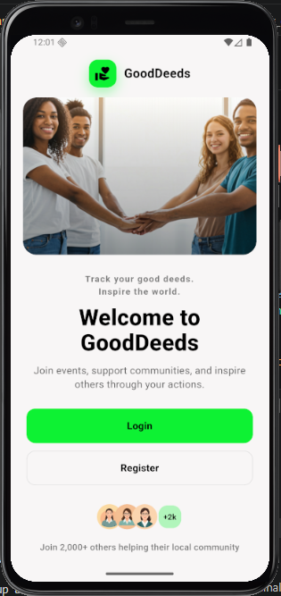
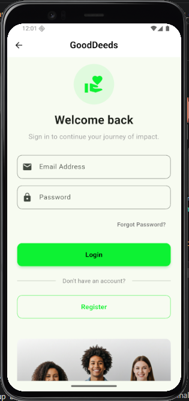
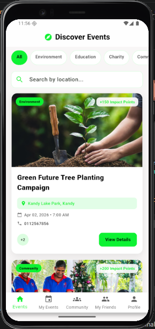
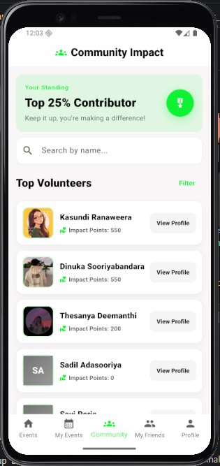
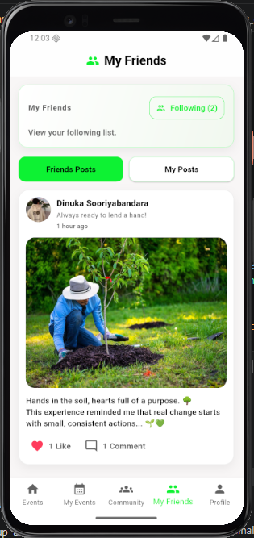
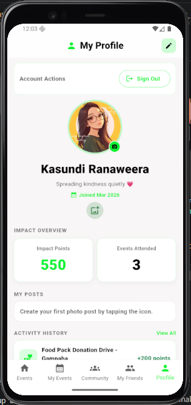

# GoodDeeds App


## Overview

GoodDeeds is a Flutter + Firebase app for organizing and joining community service events. It includes role-based access (Volunteer and Organizer), attendance tracking, social engagement, and profile activity history.

## Core Features

- Firebase authentication (email/password)
- Single-role accounts per email (Volunteer or Organizer)
- Event creation, discovery, and participation
- Discover Events shows an `Expired` status badge for past events
- Attendance check-in with a strict 48-hour window
- Reward and impact points system
- Public profile activity history with real-time likes
- Community browsing and My Friends (following) management
- Role-aware navigation and role-aware Firestore permissions

## Role and Authentication Architecture

### Single Role Per Email

Each account is restricted to one primary role.

- Role data is stored in `role` and mirrored in `roles` (single-item list) for compatibility.
- User model helper methods: `isVolunteer`, `isOrganizer`, and `hasRole()`.
- Navigation is determined by assigned role:
  - Organizer: Organizer dashboard
  - Volunteer: Discover events
- To use both roles, users must register separate accounts with different email addresses.

### Firestore Organizer Validation

Firestore rules validate organizer permissions using role metadata on the signed-in user (`role`, `roles`, or `isOrganizer`) before allowing organizer-only actions.


### Registration Data Writes

During sign up, the app writes three documents for a new account:

- `users/{uid}`: base account profile and role metadata
- `user_profiles/{uid}`: editable profile fields
- `user_lookup/{uid}`: searchable lookup record (`nameLower`, `emailLower`, role flags)

This means Firestore rules must allow owner create/update for all three paths.

## Password Reset

Forgot Password flow:

1. Tap Forgot Password on login.
2. Enter email address.
3. Tap Send Reset Link.
4. Firebase sends a reset email.
5. User resets password from email link.

Implementation references:

- Screen: [lib/screens/forgot_password_screen.dart](lib/screens/forgot_password_screen.dart)
- Firebase auth usage: `sendPasswordResetEmail()`
- Error handling includes invalid email, user not found, and rate-limited requests

## Attendance and Participation Tracking

- Managed in [lib/screens/organizer/participants_screen.dart](lib/screens/organizer/participants_screen.dart)
- Event-level tracking in `events/{eventId}`:
  - `checkedInIds`
  - `awardedParticipantIds`
- User-level mirrors in `users/{uid}`:
  - `participationStatusByEvent.{eventId}`
  - `attendanceVerifiedAtByEvent.{eventId}`
- Attendance window is from event start until exactly 48 hours later.

Volunteer status progression in My Events:

- Joined
- Pending
- Completed
- Missed

## Social and Community Features

### Public Activity Likes

- Likes are stored in `events/{eventId}/likes/{uid}`
- Each like stores `uid` and `createdAt`
- Users can only write/delete their own likes
- UI shows real-time like counts and avatars

### Post Comments

- Comments are stored in `posts/{postId}/comments/{commentId}`
- Users can create comments as themselves only
- Users can delete only their own comments
- Comments open in a dedicated full-screen comments page
- Comment list and counts update in real time
- Success feedback is shown after add/delete actions

### Profile Posts

- Post creation is available via the add-post icon in profile.

### My Friends and Following

- My Friends screen: [lib/screens/user/myfriends_screen.dart](lib/screens/user/myfriends_screen.dart)
- Community screen: [lib/screens/user/community_screen.dart](lib/screens/user/community_screen.dart)
- The user bottom navigation includes a My Friends tab across user flows.
- Following list supports profile navigation and unfollow actions.

## Main Screens

| Screen | Widget/Class | File |
|---|---|---|
| Welcome | `WelcomeScreen` | `lib/screens/welcome_screen.dart` |
| Login | `LoginScreen` | `lib/screens/login_screen.dart` |
| Register | `RegisterScreen` | `lib/screens/register_screen.dart` |
| Forgot Password | `ForgotPasswordScreen` | `lib/screens/forgot_password_screen.dart` |
| Home | `HomeScreen` | `lib/screens/home_screen.dart` |
| Discover Events | `DiscoverEventsScreen` | `lib/screens/user/discover_events_screen.dart` |
| Event Details | `EventDetailsScreen` | `lib/screens/user/event_details_screen.dart` |
| My Events | `MyEventsScreen` | `lib/screens/user/my_events_screen.dart` |
| Community | `CommunityScreen` | `lib/screens/user/community_screen.dart` |
| My Friends | `MyFriendsScreen` | `lib/screens/user/myfriends_screen.dart` |
| User Profile | `UserProfileScreen` | `lib/screens/user/user_profile_screen.dart` |
| Organizer Dashboard | `OrganizerDashboardScreen` | `lib/screens/organizer/organizer_dashboard_screen.dart` |
| Create Event | `CreateEventScreen` | `lib/screens/organizer/create_event_screen.dart` |
| Manage Event | `ManageEventScreen` | `lib/screens/organizer/manage_event_screen.dart` |
| Participants | `ParticipantsScreen` | `lib/screens/organizer/participants_screen.dart` |

## Screenshots

### Welcome



### Login



### Discover Events



### Community



### My Friends



### My Profile



## Setup and Run

1. Clone repository:

```sh
git clone https://github.com/KasundiRanaweera/GoodDeeds-Main-App.git
cd gooddeeds_app
```

2. Install dependencies:

```sh
flutter pub get
```

3. Configure Firebase:

- Add `google-services.json` to Android app config.
- Add `GoogleService-Info.plist` to iOS Runner config.
- Ensure [lib/firebase_options.dart](lib/firebase_options.dart) is correct for your Firebase project.

4. Run app:

```sh
flutter run
```

5. Deploy Firestore rules when needed:

```sh
firebase deploy --only firestore:rules
```

## Troubleshooting

### Registration shows "permission-denied"

If account creation succeeds in Firebase Auth but fails in Firestore, deploy the latest rules:

```sh
firebase deploy --only firestore:rules
```

Then verify your rules include owner create/update access for:

- `users/{uid}`
- `user_profiles/{uid}`
- `user_lookup/{uid}`

### Comments screen crashes when opening or posting

Comments now run in a dedicated full-screen page with safer async handling and fallback UI, which avoids modal build-scope crashes.

If you still see a crash:

1. Check that the post document exists.
2. Check that the signed-in user document exists in `users/{uid}`.
3. Make sure Firestore rules allow reading `posts`, `comments`, and `users`.
4. Re-run the app after clearing any old debug session.

## Project Structure

- `lib/models/` data models
- `lib/screens/` UI flows
- `lib/services/` Firebase/business logic
- `lib/widgets/` reusable widgets
- `lib/constants/` app-wide constants

## Notes

- Network images should use safe fallback patterns to avoid repeated runtime socket noise.
- For complete Firestore and Storage rule references, see [FIREBASE_STORAGE_RULES.md](FIREBASE_STORAGE_RULES.md).

---


